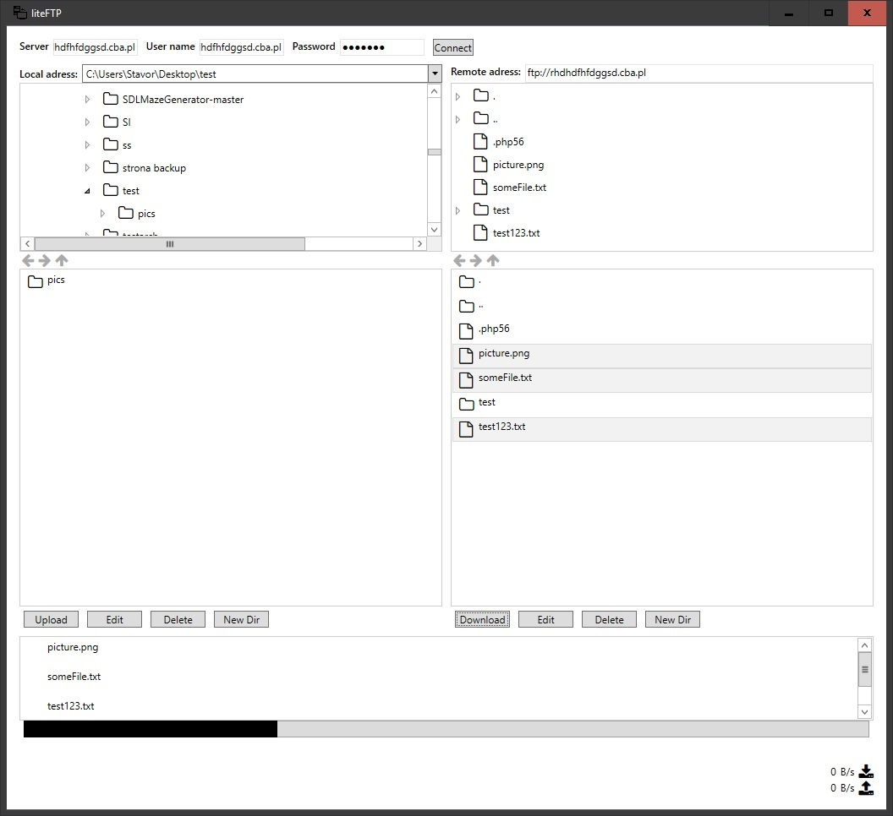

# liteFTP
    A simple, light FTP client - first stable version.

  

# Features

- file download/upload/removal

- explorer tree

- search bar with completion

- transfer queue

- remote file edit

# TODOS

-file/folder rename

-recursive folder deletion

-more info about files (size, last modify date etc)

-user preferences for editing files (this version uses windows preselected apps for opening and editing files)

-connection to many servers at time (tabs)

-transfer speed visualisation.

-custom style to make it look better.
